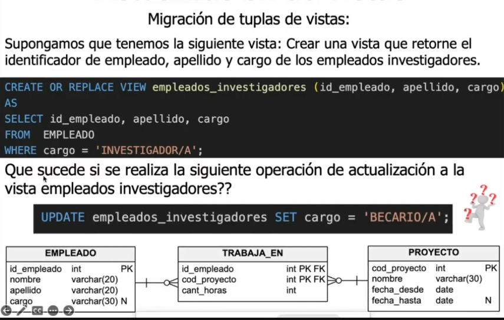

## Concepto de Vistas en Bases de Datos

- **Definición**: Una vista representa una tabla virtual o derivada de una consulta SQL. Las tuplas (filas) de esta vista se generan dinámicamente cuando se realiza una operación sobre la vista.

- **Existencia del Objeto**: 
  - La vista existe como un objeto en la base de datos. 
  - Aunque la vista está presente como un objeto, las filas no existen físicamente hasta que se opera sobre la vista.
  - En otras palabras, la vista es un objeto que no tiene invocación hasta que se accede a ella.

- **Tabla Virtual**: 
  - Una vista se define a partir de una consulta SQL y se considera una tabla virtual.
  - Los registros de esta tabla virtual no se almacenan físicamente. En su lugar, se generan en el momento en que se accede a la vista.

- **Almacenamiento de Consultas**:
  - Podemos guardar consultas complejas en una vista.
  - Los registros de esta vista no están físicamente guardados; se crean dinámicamente al acceder a la vista.

- **Propósito de las Vistas**:
  - Las vistas se utilizan principalmente por razones de **seguridad**. 
  - No todos los datos pueden ser visibles para todos los usuarios. Las vistas permiten controlar y restringir el acceso a los datos.

- **Proyección y Selección**:
  - Una vista puede ser una proyección y selección de una o más tablas de la base de datos.
  - El contenido de una vista se define como una consulta que puede involucrar una sola tabla, varias tablas, otras vistas, o una combinación de estas.

- **Estructura de la Vista**:
  - La estructura de una vista se basa en una consulta que puede ser tan simple como seleccionar datos de una sola tabla o tan compleja como combinar datos de múltiples tablas y vistas.

---

### Ejemplo de Definición de una Vista

```sql
CREATE VIEW nombre_de_la_vista AS
SELECT columna1, columna2, ...
FROM tabla_base
WHERE condicion;
```

```SQL
SELECT * FROM empleados_investigadores;
aca estamos invocando el resultado de la vista
```

## Vistas: Actualizaciones

### Concepto de Actualización en Vistas

- **CRUD en Vistas**:
  - **CRUD**: Se refiere a las operaciones de Crear (Create), Leer (Read), Actualizar (Update) y Eliminar (Delete) datos.
  - Cuando se realizan operaciones CRUD en una vista, estas deberían actualizar automáticamente la tabla base correspondiente.

- **Propagación de Actualizaciones**:
  - Las operaciones de actualización (`INSERT`, `UPDATE`, `DELETE`) realizadas sobre una vista deberían propagarse automáticamente a la tabla base en una única operación.
  - Para asegurar que la actualización sea única, la vista debe contener la clave primaria de la tabla base. Esto se conoce como **Preservación de Clave**.
  - La referencia entre la vista y la tabla base debe ser 1 a 1, lo que significa que la estructura de la vista debe incluir las claves necesarias para identificar de manera única cada registro en la tabla base.

- **Reflejo de Cambios**:
  - Al actualizar registros en la tabla base, los cambios también se reflejan automáticamente en la vista.
  - Cualquier operación del tipo CRUD realizada en la vista tendrá su efecto correspondiente en la tabla base.


### Requisitos para una Vista Actualizable

- **Tabla Única**:
  - Para que una vista sea actualizable desde el front-end, debe estar basada en una única tabla. 
  - Esto asegura que las operaciones CRUD en la vista se puedan mapear claramente a la tabla base.

- **¿Qué Sucede si se Actualiza la Vista?**:
  - Si se realizan operaciones CRUD en una vista (por ejemplo, `empleado_investigadores`), los cambios deben reflejarse automáticamente en la tabla base correspondiente (por ejemplo, `EMPLEADO`).

### Reglas para Vistas Actualizables según el Estándar SQL

El estándar SQL define que una vista sobre una tabla base es actualizable si cumple con los siguientes criterios:

1. **Preservación de Clave**:
   - La vista debe conservar todas las columnas de la clave primaria de la tabla base. Esto permite que cada fila en la vista se mapee de manera única a una fila en la tabla base.

2. **Sin Funciones de Agregación**:
   - La vista no debe contener funciones de agregación como `SUM`, `AVG`, `COUNT`, etc., o información derivada que no permita una relación 1 a 1 con la tabla base.

3. **Sin la Cláusula `DISTINCT`**:
   - La vista no debe incluir la cláusula `DISTINCT`, ya que esto puede eliminar filas duplicadas, complicando la relación directa con la tabla base.

4. **Sin Subconsultas en `SELECT`**:
   - La vista no debe incluir subconsultas en la parte `SELECT` de la definición de la vista. Las subconsultas pueden alterar la relación 1 a 1 necesaria entre la vista y la tabla base.

Estas reglas aseguran que las operaciones en la vista se pueden traducir directamente a operaciones en la tabla base sin ambigüedades.

---

### Ejemplo de Vista Actualizable

```sql
CREATE VIEW vista_actualizable AS
SELECT id, nombre, apellido, email
FROM empleados
WHERE activo = true;
```

## Ejemplos Gráficos

Para ilustrar los conceptos y reglas sobre las vistas y su actualizabilidad, a continuación se presentan algunos ejemplos gráficos:

### Ejemplos de Vistas y su Actualización


### ¿Qué Significa que una Vista No Sea Actualizable?

- **No Actualizable**: 
  - Si una vista no es actualizable, cualquier intento de realizar operaciones `INSERT`, `UPDATE` o `DELETE` en la vista no se reflejará en la tabla base.
  - Esto significa que la vista no permite modificar los datos de la tabla base a través de ella.

### Ejemplo de Vista Actualizable en PostgreSQL

- En PostgreSQL y según el estándar SQL, ciertas vistas pueden ser actualizables si cumplen con las reglas necesarias:


### Vistas de Ensamble

- **Vistas de Ensamble**: 
  - Estas vistas se definen a partir de múltiples tablas base.
  - El estándar SQL establece que una vista de ensamble es actualizable si preserva la clave de la tabla del lado N (la tabla con la multiplicidad "muchos" en la relación).


### PostgreSQL: Ejemplo de Vista No Actualizable

- **No Actualizable en PostgreSQL**: 
  - En algunos casos, incluso si una vista parece cumplir con las reglas del estándar SQL para ser actualizable, PostgreSQL puede no soportar la actualización automática sin asistencia adicional.


---

### Operaciones CRUD en Vistas sin Clave Primaria

- **Pregunta**: ¿Qué sucede si una vista no incluye la clave primaria? ¿Cómo se manejan las operaciones `INSERT`, `DELETE` o `UPDATE` en tales vistas?
  
  

- **Consulta Interna**:
  - Cuando ejecutas `SELECT * FROM nombre_de_la_view` (por ejemplo, `empleados_investigadores`), se llama a la consulta interna definida cuando se creó la vista.

- **Ejemplo de Tabla Base y Vista Derivada**:
  - **Tabla Creada**:
    
  
  - **Vista Derivada**:
    
    - La vista derivada se crea dinámicamente cuando se invoca, permitiendo uniones (`JOIN`) y ensamblajes con funciones.

### Concepto: Tabla Derivada

- **Definición**: 
  - Una tabla derivada se crea en el momento de la invocación de la vista. 
  - Esto significa que la estructura de la vista no existe físicamente en la base de datos hasta que se ejecuta una consulta que la invoque.

- **Ejemplo de Uso**:
  - Una vista puede ensamblar datos a partir de múltiples tablas o funciones en tiempo de ejecución, proporcionando una manera flexible de acceder a datos complejos sin necesidad de almacenarlos físicamente.

---

En resumen, las vistas proporcionan una forma potente y flexible de trabajar con datos en una base de datos. Sin embargo, para que una vista sea actualizable, debe cumplir con ciertas restricciones que aseguran que las operaciones en la vista se reflejen adecuadamente en las tablas base.

---
 
 ### Limitaciones en PostgreSQL y Soluciones


- **Limitaciones en PostgreSQL**:
  - En PostgreSQL, algunas vistas pueden no ser automáticamente actualizables.
  - Para manejar esta situación, es posible que necesitemos utilizar triggers `INSTEAD OF`.

### Migración de Vistas



- **Proceso de Migración**:
  - La migración de vistas implica trasladar la definición de la vista desde un entorno de base de datos a otro.
  - Esto puede ser necesario al migrar entre diferentes sistemas de gestión de bases de datos o al actualizar versiones de software.

### Uso de `WITH CHECK OPTION`

- **Condiciones de Verificación**:
  - La cláusula `WITH CHECK OPTION` se utiliza para garantizar que las operaciones `INSERT` y `UPDATE` en la vista cumplan con ciertas condiciones definidas en la vista.
  - Esta cláusula se aplica cuando la vista es actualizable y queremos asegurarnos de que las operaciones mantengan la integridad de los datos.


- **Ejemplo de Uso**:
  - Si tenemos una vista como se muestra en el ejemplo y queremos garantizar que solo se inserten o actualicen filas que cumplan con ciertas condiciones (`edad >= 18`), podemos agregar `WITH CHECK OPTION`.
  - Esto evitará que se inserten o actualicen filas que no cumplan con la condición especificada.

---

El manejo de las vistas en PostgreSQL y otros sistemas de gestión de bases de datos puede requerir la consideración de ciertas limitaciones y la aplicación de soluciones específicas, como el uso de triggers y cláusulas especiales como `WITH CHECK OPTION`, para garantizar la actualizabilidad y la integridad de los datos.


---

### Trigger `INSTEAD OF`

- **Funcionamiento**:
  - Los triggers `INSTEAD OF` en PostgreSQL permiten interceptar operaciones de inserción (`INSERT`), actualización (`UPDATE`) y eliminación (`DELETE`) en una vista y realizar acciones personalizadas en lugar de las operaciones estándar.


- **Ejemplo de Uso**:
  - En el ejemplo proporcionado, el trigger `INSTEAD OF` intercepta el evento de inserción en la vista `empleados_investigadores`.
  - Si se intenta realizar una inserción en la vista, el trigger ejecutará una operación personalizada antes de proceder con la inserción en la tabla base.


- **Interceptando Operaciones de Actualización**:
  - Si se intenta realizar una operación de actualización en una vista no actualizable, el código procedural del trigger puede interceptar este evento y ejecutar una lógica personalizada.


- **Código del Trigger**:
  - El código del trigger intercepta el evento de inserción en la vista `empleados_investigadores` y realiza una operación personalizada en la tabla base `EMPLEADO`.


- **Continuación del Código del Trigger**:
  - La lógica del trigger puede incluir manipulación de datos y verificaciones adicionales para garantizar la integridad de los datos en la tabla base.


- **Conclusión**:
  - El trigger `INSTEAD OF` se encuentra en la vista y espera eventos sobre la vista en lugar de la tabla base. Esto permite personalizar y controlar las operaciones sobre la vista de acuerdo con las necesidades específicas del sistema.


### Creación de una Vista Actualizable en PostgreSQL

## TIPICO EJERCICIO DE PARCIAL
CREAR UNA VISTA QUE SEA AUTOMATICAMENTE ACTUALIZABLE EN POSTGRESQL
debera respetar los 4 puntos del estandar.

#### Objetivo:
Crear una vista en PostgreSQL que cumpla con los estándares para ser automáticamente actualizable, según los cuatro puntos establecidos en el estándar SQL.

#### Requisitos:

1. **Preservación de Clave**:
   - La vista debe conservar todas las columnas de la clave primaria de la tabla base. Esto garantiza que cada fila en la vista se pueda mapear de manera única a una fila en la tabla base.

2. **Sin Funciones de Agregación**:
   - La vista no debe contener funciones de agregación como `SUM`, `AVG`, `COUNT`, etc., ni información derivada que no permita una relación 1 a 1 con la tabla base.

3. **Sin la Cláusula `DISTINCT`**:
   - La vista no debe incluir la cláusula `DISTINCT`, ya que esto puede eliminar filas duplicadas y complicar la relación directa con la tabla base.

4. **Sin Subconsultas en `SELECT`**:
   - La vista no debe incluir subconsultas en la parte `SELECT` de su definición. Las subconsultas pueden alterar la relación 1 a 1 necesaria entre la vista y la tabla base.

#### Ejemplo de Creación de la Vista:

```sql
CREATE VIEW vista_actualizable AS
SELECT columna1, columna2, ...
FROM tabla_base
WHERE condicion
WITH CHECK OPTION;
```


---
### Explicación:

Esta consulta define una vista llamada `vista_actualizable`.
- Selecciona columnas específicas de la tabla `tabla_base` bajo ciertas condiciones (`WHERE condicion`).
- La cláusula `WITH CHECK OPTION` se utiliza para asegurar que las operaciones `INSERT` y `UPDATE` en la vista cumplan con las condiciones definidas en la vista.

### Conclusión:

Al seguir estos estándares y utilizar la cláusula `WITH CHECK OPTION`, podemos crear una vista en PostgreSQL que sea automáticamente actualizable, garantizando la integridad de los datos y la relación adecuada con la tabla base.


