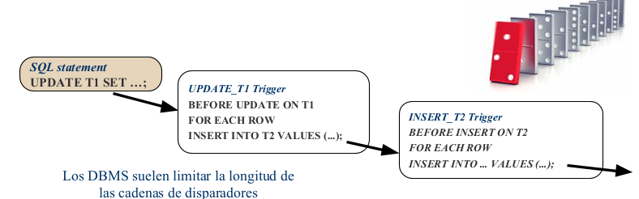
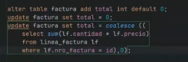

## ¿Que es un trigger?
Un trigger (disparador) es un tipo de objeto de base de datos que se utiliza para automatizar acciones o tareas en respuesta a ciertos eventos que ocurren en una tabla o vista de la base de datos. Estos eventos pueden incluir inserciones de datos (INSERT), actualizaciones de datos (UPDATE), eliminaciones de datos (DELETE), u otros eventos específicos del sistema de gestión de bases de datos (SGBD), como la activación de un trigger antes o después de la creación o eliminación de una tabla.

## ¿Para que se usa un trigger?
Los triggers son útiles para implementar la lógica empresarial compleja que no se puede manejar fácilmente a través de consultas SQL estándar o mediante la lógica de la aplicación en el nivel de la aplicación, garantizan la integridad de los datos e implementan restricciones empresariales que deben aplicarse de manera consistente, independientemente de la forma en que se realicen las operaciones en la base de datos.
mantener datos derivados - generacion automatica de datos

*como lenguaje procedural vamos a usar plpsql*

los lenguajes procedurales son los que mas se usan para el desarrollo

postrgresql tiene java con sql embebido , c tambien.

puedo definir los mismos tipos de variables que tengo en la db

select * from voluntario --> te devuelve una tabla
si yo eso lo meto en un lenguaje de programacion
me devuelve un data set (cojunto de datos que me los devuelve 
y me los pone a disposicion ) pero yo lo tengo que recorrer 
1 a 1 como si fuese un archivo y esto esta en memoria mientras dure
la ejecucuion de ese codigo, despues desaparece.

Estructura de datos , un lugar donde me deja ese resultado y yo puedo
ir recuperando 1 a 1 los registros. 

en postregresql todo es funcion no hay un create procedure
hay un create function , y las funciones puede oficilizar de procedimientos devolver vacios o devolver algo o ser funciones que van a ser ejecutadas especificamente con los triggers. este tipo de funciones tiene una caracteristica especial .


## Procedimientos Almacenados

STORED PROCEDURE es un programa (o procedimiento) almacenado físicamente en la BD. 
Su implementación varía de un DBMS a otro.

¿Como vamos a usar estos triggers?
para hacer estos controles que no pudimos meterle a la db en el tp5 por ejemplo (assertion , subqueries)


```SQL
CREATE TRIGGER nombre

{ BEFORE | AFTER | INSTEAD OF }                         ACTIVACIÓN

{ evento [ OR ... ] }                               Evento que lo dispara
        INSERT, UPDATE, DELETE, or TRUNCATE (para UPDATE OF columna1 [, columna2 ... ]

ON tabla

[ FOR [ EACH ] { ROW | STATEMENT } ] GRANULARIDAD

[ WHEN ( condición ) ] Condición

EXECUTE PROCEDURE o EXECUTE FUNCTION --se agrega v 11 , por retrocompatibilidad funcionan igualmente 

función_específica ( ) Acción
```

**ACCION**
La acción consiste en una sentencia SQL aislada o un conjunto
de sentencias, delimitadas en un bloque BEGIN . . . END

Puede referirse a valores anteriores y nuevos que se modifican,
nuevos que se insertan, o anteriores que se eliminaron, según el
evento que desencadenó la acción

Pueden incluir sentencias de control (IF … ELSE, FOR, WHILE,…)

No pueden incluir sentencias DDL (CREATE, ALTER, DROP) *no están permitidas dentro de un trigger.*

La acción del trigger es un procedimiento atómico → Si cualquier sentencia del cuerpo del trigger falla, la acción completa del trigger se deshace, incluyendo las correspondientes a la sentencia que lo disparó.

Ante un cierto evento sobre una tabla → pueden activarse varios triggers!

> [!NOTE]
> evitar realizar operaciones que alteren los datos dentro de un trigger "BEFORE". Si necesitas hacer cambios en los datos, generalmente es mejor hacerlo en un trigger "AFTER", donde ya se ha completado la operación que desencadenó el trigger y no hay riesgo de crear bucles de activación
> en programacion lo conocemos como bucle infinito.
> Se puede producir una activación de triggers en cascada → Si la activación de un trigger T1 dispara otro trigger T2: se suspende la ejecución de T1, se ejecuta el trigger anidado T2 y luego se retoma la ejecución de T1 → esto podría dar lugar a una cadena “infinita” de activaciones!



**GRANULARIDAD** 
Un trigger **FOR EACH ROW** se ejecuta por cada fila afectada por la operación que lo activa.
En este podemos definir diferentes variables como

NEW Tipo de dato RECORD; variable que almacena la nueva fila para
las operaciones INSERT/UPDATE en Triggers a nivel ROW, en los
Triggers a nivel STATEMENT es NULL.

OLD Tipo de datos RECORD; variable que almacena la antigua fila
para operaciones UPDATE/DELETE en Triggers de nivel ROW, en
Triggers de nivel STATEMENT es NULL

Un trigger **FOR STATEMENT** se ejecuta una sola vez por la sentencia completa, o antes o despues (depende si yo defini el trigger after o before).
(Por defecto → FOR EACH STATEMENT)

> [!NOTE]
> PARA POSTGRESQL TODO ES UNA FUNCION


...pero hay funciones que devuelven void entonces podemos tener
los procedimientos. La sintaxis de las funciones es:

si la funcion no es de tipo trigger va a tener 
el tipo de parametro y el tipo de retorno (puede ser void un procedimiento) o otra cosa.
el cuerpo la definicion de la funcion lo hago entre $$ despues le indico con que lenguaje lo tiene que interpretar 

```SQL

create [or replace] function nombre_funcion (lista_parametros)
    returns tipo_retorno as
$$
declare
-- declaracion de variables
begin
-- logica
end;
$$
language plpgsql

```


la funcion que son llamadas por los triggers tienen un tipo especial 
retuRn trigger

```SQL
CREATE FUNCTION nombre ( )
RETURNS trigger AS $$

[ DECLARE ]
[ declaraciones de variables ]

BEGIN
 Código PlpgSQL
END;
$$ LANGUAGE 'plpgsql';
```

ALGUNAS VARIABLES 

TG_NAME Tipo de dato text; variable que contiene el nombre del
trigger actualmente disparado.

TG_WHEN Tipo de dato text; una cadena conteniendo el string
BEFORE o AFTER dependiendo de la definición del trigger.

TG_LEVEL Tipo de dato text; una cadena conteniendo el string ROW
o STATEMENT dependiendo de la definición del trigger.

TG_OP Tipo de dato text; una cadena conteniendo el string INSERT,
UPDATE o DELETE indicando por cuál operación se disparó el trigger.

TG_TABLE_NAME Tipo de dato text; variable que contiene el
nombre de la tabla que disparó el trigger


## Eventos y Activación

EVENTO: puede ser una operación de actualización sobre la tabla
o vista a la que está asociado el trigger:

Inserción (INSERT)

Actualización (UPDATE): se puede especificar columna/s

Eliminación (DELETE)

TIEMPO DE ACTIVACIÓN: en relación a la sentencia que lo activa, el trigger puede ejecutarse:

antes de la sentencia disparadora (BEFORE)

después de la sentencia disparadora (AFTER)

en lugar de la sentencia disparadora (INSTEAD OF)

> [!NOTE]
> Por cada INSERT Va haciendo controles
pasa la clave primaria ? PK
pasa la clave foranea ? FK
pasa el trigger ?

despierta el trigger entonces activa la funcion de control. 
hay un orden de ejecucion porque para la misma tabla puedo
tener varios triggers. 


REFERENCIAS 
INSERT manipula una nueva fila (si el trigger es FOR EACH
ROW) o un nuevo conjunto de filas (si es FOR EACH
STATEMENT)

DELETE manipula una fila vieja (para triggers a nivel fila) o un
conjunto de filas o tabla vieja (para triggers de sentencia)

UPDATE manipula estados viejos y nuevos, tanto de filas como
de conjuntos de filas, según corresponda

Corresponde referirse a estos elementos como NEW. y OLD.
dentro del cuerpo de la función triggers


### Cómo comienzo a transformar las RI declarativas en procedurales?

Paso 1 - Determinando los eventos críticos, usar la matriz de ayuda

Qué tipo de granularidad debe tener un trigger que controla una RI?

Qué tipo de tiempo de activación debe tener un trigger que controla una RI?


```SQL
Ejercicio 3 - TP 3 - Los artículos pueden tener como máximo 15 palabras claves

ALTER TABLE CONTIENE

ADD CONSTRAINT CK_MAXIMO_PL_CLAVES

CHECK NOT EXISTS (

SELECT 1

FROM CONTIENE

GROUP BY id_articulo

HAVING COUNT(*) > 15);

```
```SQL
CREATE OR REPLACE FUNCTION FN_MAXIMO_PL_CLAVES() RETURNS Trigger AS $$

BEGIN

IF ((SELECT count(*) FROM CONTIENE

WHERE id_articulo = NEW.id_articulo) > 14 ) THEN

RAISE EXCEPTION 'Superó la cantidad de palabras claves en el artículo %',

NEW.id_articulo

END IF;

RETURN NEW;

END $$

LANGUAGE 'plpgsql';

CREATE TRIGGER TR_MAXIMO_PL_CLAVES

BEFORE INSERT OR UPDATE OF id_articulo

ON CONTIENE

FOR EACH ROW EXECUTE PROCEDURE FN_MAXIMO_PL_CLAVES();
```

a nivel fila se va a modificar por cada fila afectada

a nivel stament se va a ejecutar por haber modificado algo ( el trigger se ejecuta una vez independiente de la cantidad de filas q se modifiquen)


create table voluntario as select * from unc_esq_voluntario.voluntario;
me copia toda la tabla con los datos , pero ninguna de las restricciones que tiene esas tablas.

triggers se disparan cuando tenga filas afectadas por la accion de insertar, modificar , eliminar

> [!TIP]Dato de color 
>no pensar que cuando hacemos un insert va de a uno . NO!!, puedo insertar varios en un solo llamado por decirlo asi, por ejemplo:
>Insert into test1(nombre) values ('nombre1') 
>Insert into test1(nombre) values ('nombre1'), ('nombre2'),('nombre3'),('nombre4') 

cuando nos piden restriccion declarativa no hacer trigger , porque se pide DECLARATIVA (CHECK)
siempre empezar con lo mas restricctivo posible , no empezar con trigger . no siempre hay que hacer un trigger . analizar el caso siempre

> [!TIP]RECORDAR
> en las restricciones siempre se busca que esta mal.(SI ESE SELECT ME ENCUENTRA ALGO QUE ESTA MAL PIDO QUE NO EXISTA)


cada vez que se inserte una linea en linea factura yo voy a ir a la facut y le agrego el importe 

> [!WARNING]CUIDADO
NO HACER UN INSERT O CUALQUIER ACCION EN LA TABLA QUE TIENE UN TRIGGER --> STACK OVERFLOW 


Logica trivaluada , si tengo un null por ejemplo debo modificar los datos para poder trabajar con eso .
antes de hacer el triggers tener todos los datos consistentes .
por ejemplo teniamos el valor total como null

update factura set total = 0  (seteamos todos los campos en 0)
tambien podria unsar un collasce


update factura set total = (
    select sum(lf.cantidad * lf.precio) 
    from linea_factura lf 
    where lf.nrofactura = id); 

```SQL    
alter table factura add total int default 0; --> lo mas optimo y correcto
```